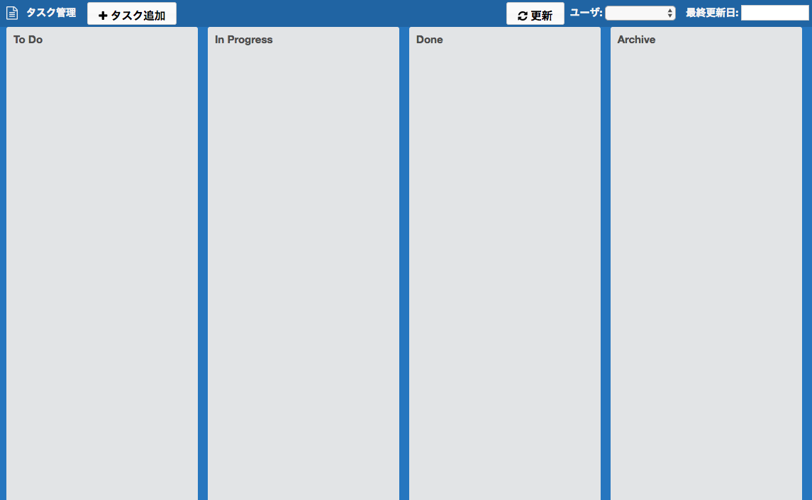
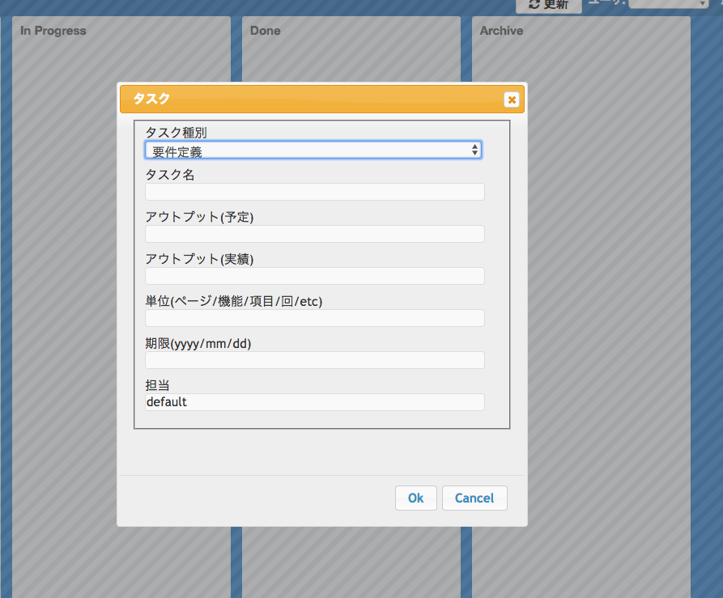
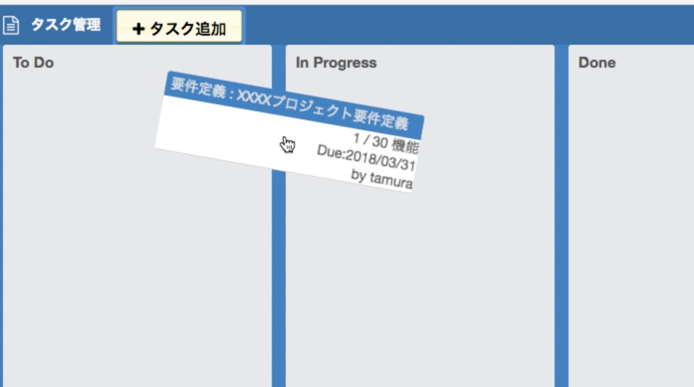

# TODOアプリ by Golang

## What

いわゆるTODO管理ツールです。
タスクを未着手、着手中、完了というステータスで分けることで現在のタスクがどれくらい進捗しているかを把握することができます。


### Screen

- 起動直後



- タスク追加



- ステータス変更



## Requiremant

- MySQL 5.5以降
- Go 1.5以降

## Usage

iltd を実行してください。

### Configuration

```
{
  appname: '左上に表示される名称。プロジェクト名などを入れましょう',
  server: {
    port: 'Webサーバのポート番号'
  },
  db: {
    username: 'DB接続ユーザ名',
    password: 'DB接続パスワード',
    host: 'DBホスト名(IPアドレスでも可)',
    port: 'MySQLポート番号(通常は3306)',
    dbname: 'データベース名'
  }
}
```

### Database

src/resources/database の中に database.txt を用意しています。
そのとおりにデータベースとテーブルを作成してください。

License
-------
Copyright &copy; 2015 tamura shingo
Licensed under the [MIT License][MIT].

[MIT]: http://www.opensource.org/licenses/mit-license.php

